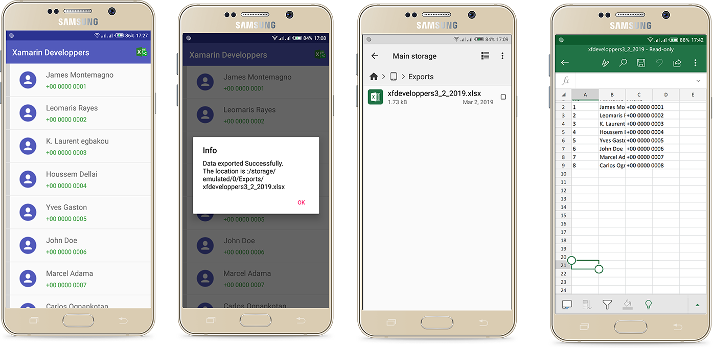

## Export ListView Items to Excel File in Xamarin.Forms



### Lioncoding article Link

[Data Export in Xamarin.Forms](https://lioncoding.com/2019/03/07/2019-03-07-export-de-donnees-sous-format-excel-dans-xamarin-forms/)

### Nuget packages used

|                           Packages                           | Version  |           Use for           |
| :----------------------------------------------------------: | :------: | :-------------------------: |
|      [Autofac](https://www.nuget.org/packages/Autofac/)      |  4.9.1   |    Inversion of control     |
| [DocumentFormat.OpenXml](https://www.nuget.org/packages/DocumentFormat.OpenXml/) |  2.9.0   | Data export to Excel format |
| [Plugin.Permissions](https://www.nuget.org/packages/Plugin.Permissions/3.0.0.12) | 3.0.0.12 |  Adding storage permission  |

### Initializations and Configurations

##### Android project

- MainActivity.cs

```c#
protected override void OnCreate(Bundle bundle)
{         
// ...
    Plugin.CurrentActivity.CrossCurrentActivity.Current.Init(this, bundle);
// ...
}

public override void OnRequestPermissionsResult(int requestCode, string[] permissions, Permission[] grantResults)
{
	PermissionsImplementation.Current.OnRequestPermissionsResult(requestCode, permissions, grantResults);
	base.OnRequestPermissionsResult(requestCode, permissions, grantResults);
}
```

- AssemblyInfo.cs (Add storage permission)

```c#
[assembly: UsesPermission(Android.Manifest.Permission.WriteExternalStorage)]
```


### Model source code

```c#
using System;
using System.Collections.Generic;
using System.Text;

namespace ExportDataToExcel.Models
{
    public class XFDeveloper
    {
        public int ID { get; set; }
        public string FullName { get; set; }
        public string Phone { get; set; }
    }
}

```

### Service which provide List items

```c#
using ExportDataToExcel.Models;
using System.Collections.Generic;

namespace ExportDataToExcel.Services
{
    public class XFDeveloperService
    {
        public static List<XFDeveloper> GetAllXamarinDevelopers()
        {
            List<XFDeveloper> developers = new List<XFDeveloper>
            {
                new XFDeveloper
                {
                    ID = 1,
                    FullName = "James Montemagno",
                    Phone = "+00 0000 0001"
                },
                new XFDeveloper
                {
                    ID = 2,
                    FullName = "Leomaris Rayes",
                    Phone = "+00 0000 0002"
                },
                new XFDeveloper
                {
                    ID = 3,
                    FullName = "K. Laurent egbakou",
                    Phone = "+00 0000 0003"
                },
                new XFDeveloper
                {
                    ID = 4,
                    FullName = "Houssem Dellai",
                    Phone = "+00 0000 0004"
                },
                new XFDeveloper
                {
                    ID = 5,
                    FullName = "Yves Gaston",
                    Phone = "+00 0000 0005"
                },
                new XFDeveloper
                {
                    ID = 6,
                    FullName = "John Doe",
                    Phone = "+00 0000 0006"
                },
                new XFDeveloper
                {
                    ID = 7,
                    FullName = "Marcel Adama",
                    Phone = "+00 0000 0007"
                },
                new XFDeveloper
                {
                    ID = 8,
                    FullName = "Carlos Ognankotan",
                    Phone = "+00 0000 0008"
                }
            };

            return developers;
        }                        
    }
}

```


### View source code(We want to export ListView items to Excel file)

```xml
<?xml version="1.0" encoding="utf-8" ?>
<ContentPage
    x:Class="ExportDataToExcel.Views.MainMenuView"
    xmlns="http://xamarin.com/schemas/2014/forms"
    xmlns:x="http://schemas.microsoft.com/winfx/2009/xaml"
    Title="{Binding Title}">


    <ContentPage.ToolbarItems>
        <ToolbarItem
            Command="{Binding ExportToExcelCommand}"
            Icon="shareexcel.png"
            Text="Export excel" />
    </ContentPage.ToolbarItems>


    <ContentPage.Content>
        <StackLayout>
            <StackLayout VerticalOptions="FillAndExpand">
                <ListView
                    CachingStrategy="RecycleElement"
                    HasUnevenRows="False"
                    ItemsSource="{Binding Developers}"
                    SeparatorColor="Transparent"
                    SeparatorVisibility="None">
                    <ListView.RowHeight>
                        <OnIdiom
                            x:TypeArguments="x:Int32"
                            Phone="80"
                            Tablet="120" />
                    </ListView.RowHeight>
                    <ListView.ItemTemplate>
                        <DataTemplate>
                            <ViewCell>
                                <Grid ColumnSpacing="20" RowSpacing="0">

                                    <Grid.ColumnDefinitions>
                                        <ColumnDefinition Width="10" />
                                        <ColumnDefinition Width="Auto" />
                                        <ColumnDefinition Width="Auto" />
                                    </Grid.ColumnDefinitions>

                                    <Grid.RowDefinitions>
                                        <RowDefinition Height="*" />
                                        <RowDefinition Height="1" />
                                    </Grid.RowDefinitions>

                                    <BoxView
                                        Grid.Row="0"
                                        Grid.Column="0"
                                        BackgroundColor="LightGray"
                                        HorizontalOptions="Start"
                                        WidthRequest="10" />


                                    <Image
                                        Grid.Row="0"
                                        Grid.Column="1"
                                        HeightRequest="50"
                                        Source="user.png"
                                        WidthRequest="50" />


                                    <StackLayout
                                        Grid.Row="0"
                                        Grid.Column="2"
                                        HorizontalOptions="FillAndExpand"
                                        Orientation="Vertical"
                                        VerticalOptions="Center">
                                        <!--  FULLNAME  -->
                                        <Label
                                            FontSize="18"
                                            HorizontalOptions="FillAndExpand"
                                            Text="{Binding FullName}"
                                            VerticalOptions="Start" />
                                        <!--  PHONE  -->
                                        <Label
                                            FontSize="15"
                                            Text="{Binding Phone}"
                                            TextColor="#43A047"
                                            VerticalOptions="Start" />
                                    </StackLayout>


                                    <BoxView
                                        Grid.Row="1"
                                        Grid.Column="0"
                                        Grid.ColumnSpan="4"
                                        BackgroundColor="LightGray"
                                        HeightRequest="1"
                                        Opacity=".5"
                                        VerticalOptions="End" />
                                </Grid>
                            </ViewCell>
                        </DataTemplate>
                    </ListView.ItemTemplate>
                </ListView>
            </StackLayout>
        </StackLayout>
    </ContentPage.Content>
</ContentPage>
```

### Code behind

```c#
using ExportDataToExcel.ViewModels;

using Xamarin.Forms;
using Xamarin.Forms.Xaml;

namespace ExportDataToExcel.Views
{
    [XamlCompilation(XamlCompilationOptions.Compile)]
    public partial class MainMenuView : ContentPage
    {
        private MainMenuViewModel viewModel;
        public MainMenuView()
        {
            InitializeComponent();
            BindingContext = viewModel = new MainMenuViewModel();
            RegisterMesssages();
        }


        private void RegisterMesssages()
        {
            MessagingCenter.Subscribe<MainMenuViewModel>(this, "DataExportedSuccessfully", (m) =>
            {
                if (m != null)
                {
                    DisplayAlert("Info", "Data exported Successfully. The location is :"+m.FilePath, "OK");
                }
            });

            MessagingCenter.Subscribe<MainMenuViewModel>(this, "NoDataToExport", (m) =>
            {
                if (m != null)
                {
                    DisplayAlert("Warning !", "No data to export.", "OK");
                }
            });
        }

    }
}
```

### View Model code

```c#
using DocumentFormat.OpenXml;
using DocumentFormat.OpenXml.Packaging;
using DocumentFormat.OpenXml.Spreadsheet;
using ExportDataToExcel.Interfaces;
using ExportDataToExcel.Models;
using ExportDataToExcel.Services;
using Plugin.Permissions;
using Plugin.Permissions.Abstractions;
using System;
using System.Collections.ObjectModel;
using System.Diagnostics;
using System.Linq;
using System.Windows.Input;
using Xamarin.Forms;
using Cell = DocumentFormat.OpenXml.Spreadsheet.Cell;

namespace ExportDataToExcel.ViewModels
{
    public class MainMenuViewModel : BaseViewModel
    {
       
        public MainMenuViewModel()
        {
            Title = "Xamarin Developers";
            LoadData();
            ExportToExcelCommand = new Command(async () => await ExportDataToExcelAsync());
        }

        /* Get Xamarin developers list from Service*/
        private void LoadData()
        {
            Developers = new ObservableCollection<XFDeveloper>(XFDeveloperService.GetAllXamarinDevelopers());
        }


        /* Export the list to excel file at the location provide by DependencyService */
        public async System.Threading.Tasks.Task ExportDataToExcelAsync()
        {
            // Granted storage permission
            var storageStatus = await CrossPermissions.Current.CheckPermissionStatusAsync(Permission.Storage);

            if (storageStatus != PermissionStatus.Granted)
            {
                var results = await CrossPermissions.Current.RequestPermissionsAsync(new[] { Permission.Storage });
                storageStatus = results[Permission.Storage];
            }

            if (Developers.Count() > 0)
            {
                try
                {
                    string date = DateTime.Now.ToShortDateString();
                    date = date.Replace("/", "_");

                    var path = DependencyService.Get<IExportFilesToLocation>().GetFolderLocation() + "xfdevelopers" + date + ".xlsx";
                    FilePath = path;
                    using (SpreadsheetDocument document = SpreadsheetDocument.Create(path, SpreadsheetDocumentType.Workbook))
                    {
                        WorkbookPart workbookPart = document.AddWorkbookPart();
                        workbookPart.Workbook = new Workbook();

                        WorksheetPart worksheetPart = workbookPart.AddNewPart<WorksheetPart>();
                        worksheetPart.Worksheet = new Worksheet();

                        Sheets sheets = workbookPart.Workbook.AppendChild(new Sheets());
                        Sheet sheet = new Sheet() { Id = workbookPart.GetIdOfPart(worksheetPart), SheetId = 1, Name = "Xamarin Forms developers list" };
                        sheets.Append(sheet);

                        workbookPart.Workbook.Save();

                        SheetData sheetData = worksheetPart.Worksheet.AppendChild(new SheetData());

                        // Constructing header
                        Row row = new Row();

                        row.Append(
                            ConstructCell("No", CellValues.String),
                            ConstructCell("FullName", CellValues.String),
                            ConstructCell("Phone", CellValues.String)
                            );

                        // Insert the header row to the Sheet Data
                        sheetData.AppendChild(row);

                        // Add each product
                        foreach (var d in Developers)
                        {
                            row = new Row();
                            row.Append(
                                ConstructCell(d.ID.ToString(), CellValues.String),
                                ConstructCell(d.FullName, CellValues.String),
                                ConstructCell(d.Phone, CellValues.String));
                            sheetData.AppendChild(row);
                        }

                        worksheetPart.Worksheet.Save();
                        MessagingCenter.Send(this, "DataExportedSuccessfully");
                    }

                }
                catch (Exception e)
                {
                    Debug.WriteLine("ERROR: "+ e.Message);
                }
            }
            else
            {
                MessagingCenter.Send(this, "NoDataToExport");
            }
        }


        /* To create cell in Excel */
        private Cell ConstructCell(string value, CellValues dataType)
        {
            return new Cell()
            {
                CellValue = new CellValue(value),
                DataType = new EnumValue<CellValues>(dataType)
            };
        }


        public ICommand ExportToExcelCommand { get; set; }

        private ObservableCollection<XFDeveloper> _developers;
        public ObservableCollection<XFDeveloper> Developers
        {
            get { return _developers; }
            set { SetProperty(ref _developers, value); }
        }

        private string _filePath;
        public string FilePath
        {
            get { return _filePath; }
            set { SetProperty(ref _filePath, value); }
        }

    }   
}

```

### Screenshots

